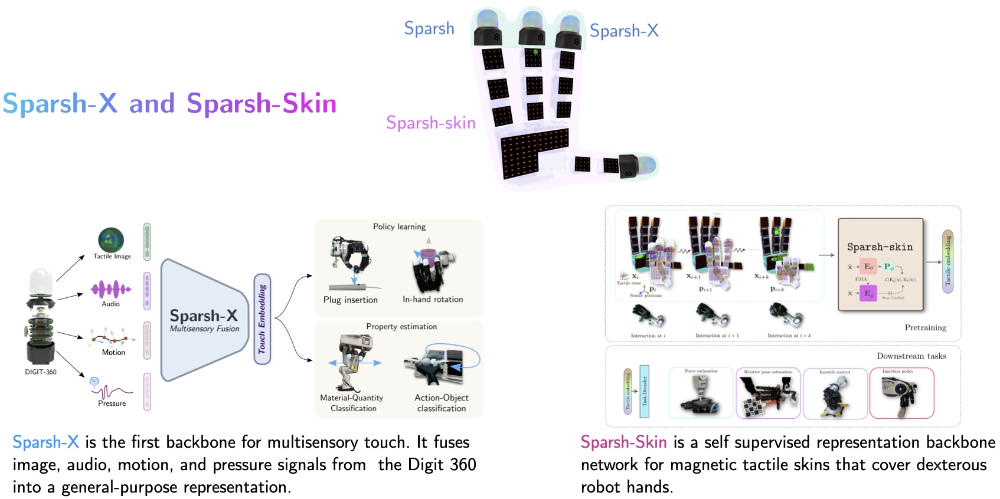
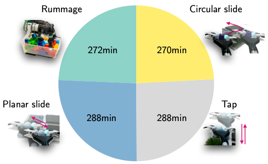
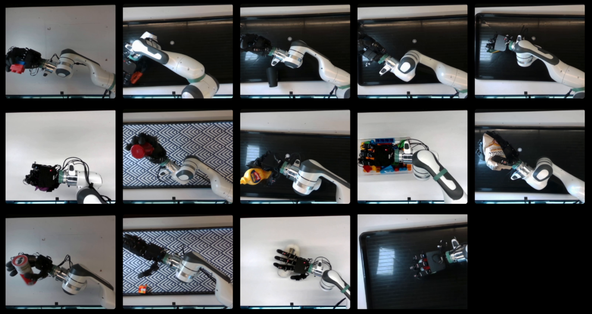

# Multisensory Touch Representations for full hand dexterous manipulation

<p align="center">

</p>

This repository contains training and evaluation code for Sparsh-X and Sparsh-Skin, a family of encoder backbones for multisensory touch representation learning:

- **Sparsh-X**: Focuses on fusing multiple tactile sensing modalities available in the Digit 360 sensor (tactile image, audio, IMU and pressure)
- **Sparsh-Skin**: Provides embeddings for tactile data from magnetic skins covering dexterous hands

<p align="center">
  <a href=https://ai.facebook.com/research/ai-systems>AI at Meta, FAIR</a>;
  <a href=https://ri.cmu.edu/>The Robotics Institute, CMU</a>;
  <a href=https://www.washington.edu/>University of Washington</a>
</p>
<p align="center">
<sup>*</sup>Equal contribution,
<sup>+</sup>Equal Advising
</p>

<h2 align='center'>Sparsh-X</h2>
<p align="center">
Carolina Higuera*, Akash Sharma*, Taosha Fan*, Chaithanya Krishna Bodduluri, Byron Boots, Michael Kaess, Mike Lambeta, Tingfan Wu, Zixi Liu, Francois Robert Hogan+, Mustafa Mukadam+ </p>
<p align='center'><small> CoRL 2025 (Oral) </small></p>
<p align="center">
  <a href="https://arxiv.org/abs/2506.14754"></img></a>
  <a href="https://akashsharma02.github.io/sparsh-x-ssl/"></img></a>
  <a href="https://youtu.be/lJ4JGNmo-do"></img></a>
  <a href="https://huggingface.co/collections/carohiguera/sparsh-x-68a02683b28a46ccae83cf77"></img></a>
  <a href="#-citing-sparsh-x-and-sparsh-skin"></img></a>

</p>

<h2 align='center'>Sparsh-Skin</h2>
<p align="center">
Akash Sharma, Carolina Higuera, Chaithanya Krishna Bodduluri, Zixi Liu, Taosha Fan, Tess Hellebrekers, Mike Lambeta, Byron Boots, Michael Kaess, Tingfan Wu, Francois Robert Hogan, Mustafa Mukadam </p>
<p align='center'><small>CoRL 2025</small></p>
<p align="center">
  <a href="https://arxiv.org/abs/2505.11420"></img></a>
  <a href="https://akashsharma02.github.io/sparsh-skin-ssl/"></img></a>
  <a href="https://youtu.be/T_ha7fH7qKM?si=Nks2St5Scz5IJriA"></img></a>
  <a href=""></img></a>
  <a href="#-citing-sparsh-x-and-sparsh-skin"></img></a>

</p>


## 🛠️Installation and setup

Clone this repository:
```bash
git clone https://github.com/facebookresearch/sparsh-multisensory-touch.git
cd tactile-ssl
```
Then,  create the `tactile_ssl` python environment. We recommend creating a new environment using `mamba` or `conda`. Our code needs `python >= 3.9`.
```bash
bash local_env.sh 
```

Finally you can install the `tactile-ssl` package as

```bash
pip install -e .
```

## Getting started

### 🚀 Pretrained Model Weights

We provide various pretrained model weights for different sensor configurations and model sizes. Click the links below to download from Hugging Face:

<!-- <table style="margin: auto">
  <thead>
  <tr>
    <th>Backbone</th>
    <th>Model size tiny</th>
    <th>Model size base</th>
  </tr>
  </thead>
  <tbody>
  <tr>
    <td>Sparsh-X (Digit 360) img-mic-imu-pressure</td>
    <td><a href="https://drive.google.com/file/d/1zhi3WGjK6zXywaMvsqA_x2cFHIjnm-Oz/view?usp=drive_link">ckpt</a></td>
    <td><a href="https://drive.google.com/file/d/1KesjZbvoq3P1hIhv5lIV3KIwJ4347h82/view?usp=drive_link">ckpt</a></td>
  </tr>
  <tr>
    <td>Sparsh-X (Digit 360) img</td>
    <td>:x:</td>
    <td><a href="https://drive.google.com/file/d/1F4ZpISGeBNwcLOFnSNOJtmGP22XSWa3m/view?usp=drive_link">ckpt</a></td>
  </tr>
  <tr>
    <td>Sparsh-Skin (Xela)</td>
    <td><a href="https://drive.google.com/file/d/1OfvFdNEU1brxelcCRrspOv58wLCpYBcX/view?usp=drive_link">ckpt</a></td>
    <td>:x:</td>
  </tr>
  </tbody>
</table> -->

<table style="margin: auto">
  <thead>
  <tr>
    <th>Backbone</th>
    <th>Weights (hf &#x1F917)</th>
  </tr>
  </thead>
  <tbody>
  <tr>
    <td>Sparsh-X (Digit 360) img-mic-imu-pressure</td>
    <td><a href="https://huggingface.co/facebook/sparsh-x-all">ckpt</a></td>
  </tr>
  <tr>
    <td>Sparsh-X (Digit 360) img</td>
    <td><a href="https://huggingface.co/facebook/sparsh-x-img">ckpt</a></td>
  </tr>
  <tr>
    <td>Sparsh-Skin (Xela)</td>
    <td><a href="https://huggingface.co/facebook/sparsh-skin">ckpt</a></td>
  </tr>
  </tbody>
</table>


### 📝 Task and Training Configuration

We use [Hydra](https://hydra.cc/) for configuration management. All config files can be found in `config/experiment/d360` folder for Sparsh-X and `config/experiment/xela` for Sparsh-Skin.

The config folder is organized as follows:

```bash
├── config
│   ├── data # contains dataset configs
│   ├── experiment # contains full config for experiments per sensor 
|   |   ├── d360
|   |   |   ├── dino.yaml # SSL training config for a self-distillation approach
|   |   |   ├── downstream_task # contains configs for downstream evaluation of the Sparsh-X  encoder
|   |   |   |   ├── force # (e.g. normal force regression)
|   |   |   |   |   ├── dino.yaml # config for normal force regression task using pretrained Sparsh-X encoder
|   |   |   |   |   ├── e2e.yaml # config for normal force regression task in an end-to-end approach.
|   |   ├── xela
|   |   |   ├── dinov2.yaml # SSL training config for a self-distillation approach
|   |   |   ├── task # contains configs for downstream evaluation of the Sparsh-skin encoder
|   |   |   |   ├── ...
│   ├── algorithm # contains configs for each ssl algorithm
│   ├── paths # add your config here with paths to datasets / checkpoint / outputs / etc.
│   ├── task # contains downstream_task configs
│   ├── wandb # add your wandb config here for experiment tracking
│   ├── default.yaml # The SSL training default config is overridden by the SSL experiment to launch (e.g experiment/d360/dino.yaml)
```


### ⏩ Forward pass with pretrained Sparsh model

You can run the following script to test the pretrained Sparsh-X model on a dummy input.

1. For the Sparsh-X model you can do the following:
```python
import torch
import torch.nn as nn
import torch.nn.functional as F
from tactile_ssl.build_encoder import build_encoder

config = "config/encoder/digit360_sparshx.yaml"
ckpt_path = "checkpoints/d360_sparshx_img_mic_imu_pressure_base.pth" # change to your checkpoints path

sparsh_encoder = build_encoder(config, ckpt_path=ckpt_path, device="cuda", mode="eval")

with torch.inference_mode():
  # Dummy input
  tactile_img = torch.randn(1, 6, 224, 224)
  tactile_audio = torch.randn(1, 224, 256)
  tactile_imu = torch.randn(1, 224, 3)
  tactile_pressure = torch.randn(1, 224, 1)
  # -----------

  input_dict = {
    "img": tactile_img.to("cuda"),
    "mic": tactile_audio.to("cuda"),
    "imu": tactile_imu.to("cuda"),
    "pressure": tactile_pressure.to("cuda"),
  }
  # Forward pass
  tactile_rep = sparsh_encoder(input_dict)

  # organize output
  tactile_embeddings = []
  for k, v in tactile_rep.items():
    print(f"{k}: {v.shape}")
    rep = F.layer_norm(v, (v.shape[-1], ))
    tactile_embeddings.append(rep)
  tactile_embeddings = torch.cat(tactile_embeddings, dim=1)
```
2. Similarly, for the Sparsh-Skin model you can do the following:
```python
import torch
import torch.nn as nn
import torch.nn.functional as F
from tactile_ssl.build_encoder import build_encoder
config = "config/encoder/xela_sparshskin.yaml"
ckpt_path = "checkpoints/xela_sparshskin_tiny.pth"

sparsh_encoder = build_encoder(config, ckpt_path=ckpt_path, device="cuda", mode="eval")

with torch.inference_mode():
  # Dummy input
  input = torch.randn(1, 100, 368, 6).to("cuda")  # batch, sequence, num_sensors, channels (xyz + position)

  # Forward pass
  tactile_rep = sparsh_encoder.forward_features(input)

  # organize output
  tactile_embeddings = []
  for k, v in tactile_rep.items():
    print(f"{k}: {v.shape}")
    rep = F.layer_norm(v, (v.shape[-1],))
    tactile_embeddings.append(rep)
  tactile_embeddings = torch.cat(tactile_embeddings, dim=1)
```


## 🏋️‍♂️ Training tactile representations

Add the corresponding `data/`, `algorithm/` and `experiment/` config files for your sensor and SSL pretraining dataset. For launching the training job, run:

```bash
python train.py +experiment=d360/dino.yaml paths=${YOUR PATH CONFIG} wandb=${YOUR WANDB CONFIG} use_img=true use_mic=true use_imu=true use_pressure=true model_size=base fusion_type=bottleneck
```

Note that this repository provides dataloaders for the Digit 360 (multisensory touch) and Xela sensor (magnetic skin). To use the same architecture and training methodology with a different touch sensor, you'll need to implement a custom dataloader compatible with your specific sensor's data format.

To do this:
1. Create a new dataloader in the `tactile_ssl/data/` directory
2. Update the configuration files to reference your new dataloader
3. Ensure your data is preprocessed to match the expected input format


### Training downstream tasks

```bash
python train_task.py +experiment=${YOUR EXP NAME} paths=${YOUR PATH CONFIG} wandb=${YOUR WANDB CONFIG} task.sensors=[img, mic, imu, pressure] +paths.encoder_checkpoint_root=${ROOT PATH TO CKPTS}
```
## 📥 Pretraining datasets

### Sparsh-X

<div style="display: flex; align-items: center;">
<div style="flex: 2;">
Our SSL training dataset consists of ∼1M samples generated from two primary sources: an Allegro hand with Digit 360 sensors on the fingertips that performs random motions with objects such as dipping into a tray filled with various items; and a manual picker with the same sensor adapted to the gripping mechanism, used to execute atomic manipulation actions such as picking up, sliding, tapping, placing, and dropping objects against diverse surfaces that vary in roughness, hardness, softness, friction, and texture properties.
</div>
<div style="flex: 1; text-align: right;">

</div>
</div>

We provide the sequences used for SSL training in `pickle` format. Each sequence has the following structure:

```bash
├── data.pickle
│   ├── d360_0
│   |   ├── image_raw/compressed # list of msgs with tactile image @30Hz
│   |   ├── imu_quat_topic  # list of msgs with IMU quaternion data @400Hz
│   |   ├── imu_raw_topic # list of msgs with raw 3-axis accelerometer data @400Hz
│   |   ├── mic_0 # list of time-series messages from contact microphone @48kHz
│   |   ├── mic_1 # list of time-series messages from contact microphone @48kHz
│   |   ├── pressure_topic # list of time-series messages from pressure @200Hz
```

Use the script `scripts/d360/mcap2pickle.py` to convert an `.mcap` rosbag into the required `pickle` format.
Use the script `tactile_ssl/data/d360_tactile.py` to format the inputs (dataset) for Sparsh-X.

<div>
🤗 Download our dataset from <a href="https://huggingface.co/datasets/facebook/sparsh-x-dataset">Hugging Face</a>!
</div>


### Sparsh-skin 
<div style="display: flex; align-items: center;">
<div style="flex: 2;">
For Sparsh-skin the dataset consists of ~4 hours of contact data with different types of household objects, collected via a VR teleoperation using the Meta Quest 3. There are 14 different objects in the dataset, each containing 10 sequences per object, which are each ~2 mins long. Every object has varied interaction with the object, including sliding, tapping, object reorientation in the hand, and the like.
</div> 
<div style="flex: 1; text-align: right;">

</div>
</div>

We provide the sequences used for SSL training in an extracted `pickle` format. Each sequence in the dataset has the following structure: 

```bash
.
├── ball
│   ├── 0
│   │   ├── allegro # contains data.pkl with allegro joint states information
│   │   ├── left_camera # contains auxiliary left camera view for inspection
│   │   ├── top_camera # contains auxiliary top camera view for inspection
│   │   └── xela # contains `data.pkl` and `forces.pkl`; `data.pkl` contains raw data used for training, and `forces.pkl` contains 
│   ├── 1
|   |....
| 
|-- baseline
│   ├── allegro
│   ├── realsense
│   │   └── color
│   └── xela
|-- urdf
```

<div>
Download our dataset from <a href="https://huggingface.co/datasets/facebook/sparsh-skin-dataset">Hugging Face</a>!
</div>


## License
This project is licensed under [LICENSE](LICENSE).

## 📚 Citing the Sparsh family of tactile representations

If you find this repository useful, please consider giving a star :star: and citation:

```bibtex
@inproceedings{
sharma2025selfsupervised,
title={Self-supervised perception for tactile skin covered dexterous hands},
author={Akash Sharma and Carolina Higuera and Chaithanya Krishna Bodduluri and Zixi Liu and Taosha Fan and Tess Hellebrekers and Mike Lambeta and Byron Boots and Michael Kaess and Tingfan Wu and Francois Robert Hogan and Mustafa Mukadam},
booktitle={9th Annual Conference on Robot Learning},
year={2025},
url={https://openreview.net/forum?id=eLeCrM5PEO}
}
```

```bibtex
@inproceedings{
higuera2025tactile,
title={Tactile Beyond Pixels: Multisensory Touch Representations for Robot Manipulation},
author={Carolina Higuera and Akash Sharma and Taosha Fan and Chaithanya Krishna Bodduluri and Byron Boots and Michael Kaess and Mike Lambeta and Tingfan Wu and Zixi Liu and Francois Robert Hogan and Mustafa Mukadam},
booktitle={9th Annual Conference on Robot Learning},
year={2025},
url={https://openreview.net/forum?id=sMs4pJYhWi}
}
```

```bibtex
@inproceedings{
  higuera2024sparsh,
  title={Sparsh: Self-supervised touch representations for vision-based tactile sensing},
  author={Carolina Higuera and Akash Sharma and Chaithanya Krishna Bodduluri and Taosha Fan and Patrick Lancaster and Mrinal Kalakrishnan and Michael Kaess and Byron Boots and Mike  Lambeta and Tingfan Wu and Mustafa Mukadam},
  booktitle={8th Annual Conference on Robot Learning},
  year={2024},
  url={https://openreview.net/forum?id=xYJn2e1uu8}
}
```

## 🤝 Acknowledgements


The authors thank Unnat Jain, Hung-Jui Huang, Youngsun Wi, Changhao Wang, Haozhi Qi, Luis Pineda, Jessica Yin, Tarasha Khurana, Mrinal Kalakrishnan and Jitendra Malik for helpful discussions on the research and reviews of the papers. This work is supported by Meta FAIR labs.
